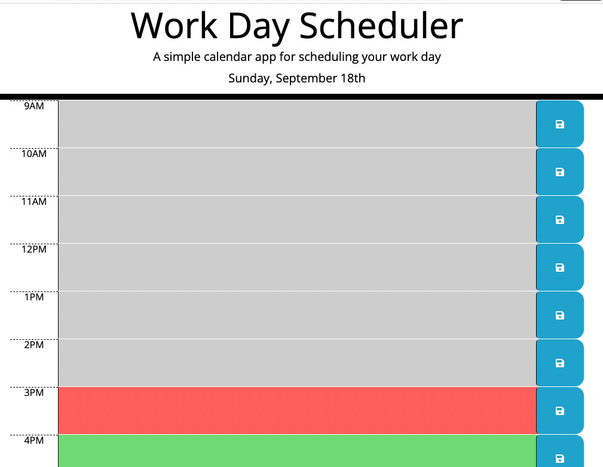

# Daily Calendar

## Description

* The repository shows an application of a work day scheduler where the user can input tasks for each hour of a specific work day.  This app runs in the browser and features dynamically updated HTML and CSS powered by JQuery.  It has a responsive user interface to be laid out properly on various size screens.

* The user can select one of the hour timeblock fields in the range of 9AM to 5PM.  The user can then enter text to the selected timeblock.  Upon adding text, the user can select the "save" button for that timeblock and the information in that timeblock will be saved to local storage. 

* The HTML code contains a logical structure for the elements within the page.  There are sections within the body showing how the first page looks.

* The project uses Bootstrap, Fontawesome and Google fonts, with links shown on the head section of the HTML.  There is also linked CSS stylesheet in the head section of the HTML. 

* The project uses JQuery and Moments.js with links under the script tag on the HTML page.  There is a linked Javascipt file as well under the script tag.

* Notes have been applied to the HTML code, CSS and JavaScript code to identify each section of code. 

## Installation

* The project is currently running on Github server.  It can be viewed at: https://c-alanwill.github.io/coding-quiz/

The code for this project can be found on GitHub at: https://github.com/c-alanwill/coding-quiz

There is an index.html file to view the application.  An image of the initial page of the quiz is contained under the "assets" folder.

## Usage

The following image demonstrates the web application's appearance and functionality:

## Credits

N/A

## License

Please refer to the license in the repo.